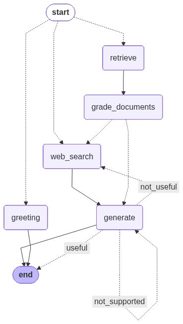

# Agentic RAG

## Description
Using LangGraph to build agentic workflow based on
- Corrective-RAG (CRAG) paper uses self-grading on retrieved documents and web-search fallback if documents are not relevant.
- Self-RAG paper adds self-grading on generations for hallucinations and for ability to answer the question.
- Adaptive RAG paper routes queries between different RAG approaches based on their complexity.


LangGraph built-in mermaid visualization


## Installation

To get started, follow these steps:

1. **Clone the repository**:
    ```sh
    git clone https://github.com/gotsulyakk/agentic-rag.git
    cd agentic-rag
    ```

2. **Install dependencies**:
    [Poetry](https://python-poetry.org/) is recommended for dependency management.
    ```sh
    poetry install
    ```

3. **Set up environment variables**:
    Create a `.env` file in the root directory and add necessary environment variables.
    ```sh
    GOOGLE_API_KEY
    TAVILY_API_KEY
    LANGCHAIN_API_KEY
    LANGCHAIN_TRACING_V2
    LANGCHAIN_PROJECT

    # Database connection (defaults align với backend `api-edtech`)
    RAG_DB_HOST=localhost
    RAG_DB_PORT=5432
    RAG_DB_NAME=postgres
    RAG_DB_USER=postgres
    RAG_DB_PASSWORD=postgres

    # Tùy chọn cho vector store
    CHROMA_COLLECTION_NAME=rag-edtech
    CHROMA_PERSIST_DIR=.chroma
    RAG_CHUNK_SIZE=700
    RAG_CHUNK_OVERLAP=120
    USER_AGENT=agentic-rag/0.1 (local)
    ```

## Usage

To run the main application:

```sh
cd agentic_rag
poetry run python main.py
```

To launch the Gradio UI:

```sh
cd agentic_rag
poetry run python ui.py
```

## Acknowledgements

- https://www.youtube.com/watch?v=NZbgduKl9Zk
- https://www.youtube.com/watch?v=zXFxmI9f06M
- https://github.com/mistralai/cookbook/tree/main/third_party/langchain